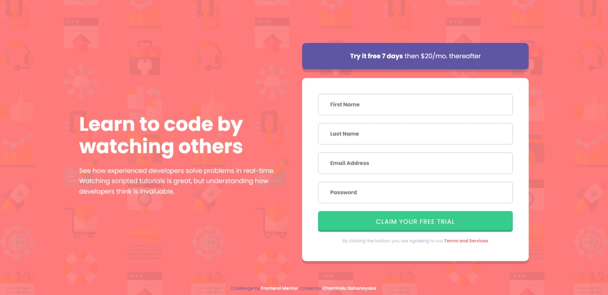

# Frontend Mentor - Intro component with sign up form solution

This is a solution to the [Intro component with sign up form challenge on Frontend Mentor](https://www.frontendmentor.io/challenges/intro-component-with-signup-form-5cf91bd49edda32581d28fd1). Frontend Mentor challenges help you improve your coding skills by building realistic projects. 

## Table of contents

- [Overview](#overview)
  - [The challenge](#the-challenge)
  - [Screenshot](#screenshot)
  - [Links](#links)
- [My process](#my-process)
  - [Built with](#built-with)
  - [What I learned](#what-i-learned)
  - [Continued development](#continued-development)
- [Author](#author)

## Overview

### The challenge

Users should be able to:

- View the optimal layout for the site depending on their device's screen size
- See hover states for all interactive elements on the page
- Receive an error message when the `form` is submitted if:
  - Any `input` field is empty. The message for this error should say *"[Field Name] cannot be empty"*
  - The email address is not formatted correctly (i.e. a correct email address should have this structure: `name@host.tld`). The message for this error should say *"Looks like this is not an email"*

### Screenshot



### Links

- Solution URL: [Solution URL here](https://www.frontendmentor.io/solutions/responsive-intro-component-with-sign-up-form-using-css-grid-LDoO_QVRAY)
- Live Site URL: [Live site URL here](https://chamindud.github.io/Intro-component-with-sign-up-form/)

## My process

### Built with

- Semantic HTML5 markup
- Flexbox
- CSS Grid
- Mobile-first workflow

### What I learned

In this project, I learned to use below code snippets:

```html
<input type="text" name="first-name" id="first-name" placeholder="First Name" onkeyup="checkFirstName()">
<input type="email" name="email" id="email" placeholder="Email Address" onkeydown="checkEmail()">
<button id="btn" onclick="return claim()">Claim your free trial</button>
```
```css
form img{
  position: absolute;
  right: 44px;
  transform: translateY(-40px);
  display: none;
}
```
```js
function claim(){
  if(!checkFirstName() || !checkLastName() || !checkEmail() || !checkPassword()){
    button.type = "button";
    return false;
  }else{
    button.type ="submit";
    return true;
  }
}
```

### Continued development

I'm looking to improve my CSS & JavaScript knowledge to design more unique and new stuff.

## Author

- Frontend Mentor - [@ChaminduD](https://www.frontendmentor.io/profile/ChaminduD)
- LinkedIn - [Chamindu Dahanayaka](https://www.linkedin.com/in/chamindudahanayaka/)